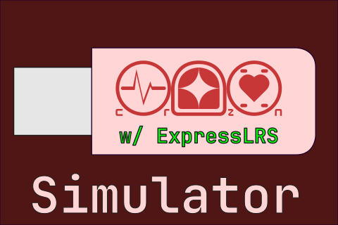
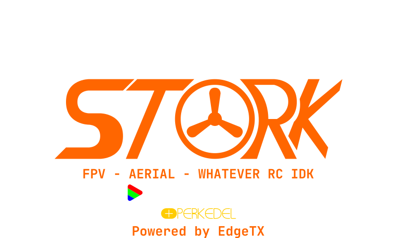

# EdgeTX Pack

Here are Packfiles for EdgeTX

## Advices

We've been scouring intels around the world about FPV and pretty much RCs of all kinds. Here are the advices we got so far:

- **Start from only Remote**. No Drone itself, just the remote. Yes, I know sounds weird. BUT trust me, when everyone in the RC community (both Flyings & Lands, on YouTube and other forums) say it, **that's because we already have simulator**. Comparatively only costs so much (even better, MultiTalent is $0, and there is permanent game mode about it!), and breaking your RC unit do not cost you anything huge if you did it IRL.
- **Never mess with your Input-Mixer-Output & Trims**! You no longer have to anymore this day, and if you messed up those Input-Mixer-Outputs, congratulations, you'll fly and drive tilt forever. **Always tune exclusively from the Core unit of the drone itself!!**, be with with **[Betaflight App](https://app.betaflight.com/), [Bluejay](https://esc-configurator.com/), Stork 🫀🩺🛠️ CardioTweaks, etc.** RC Core units these days are very sophisticated and has at worst mode, a minimum critical self adjusting. Therefore to tune your drone so it flies and drives stable, configure just the core unit with their respective configurator App. 
  - The RC, leave as is. Whatever it provided you, just leave it like that (but if it's not AETR (Ch0 `Ail`, Ch1 `Ele`, Ch1 `Thr`, Ch2 `Rud`), reorder them), Never mess with curves, etc. etc.
  - Also Disable the Trim! That's no longer needed, again your RC Core already has smarterest stabilizer too. go to `MDL` (press 1x), `Flight Modes`, the first one `FM0`, and turn off all of the trims. **Repeat for all Models**. And in Companion, Open up each & every model, `Flight Modes`, first one `FM0`, disable all trims down there. Now you can use these Trim buttons for something else yay!
  - You can still mess around with its Sounds & Themes. So add those Meme & those 😏😏😏😏 stuffs there. **No, don't do 😏😏😏😏 if you're bringing your RC to public**, there maybe those who mentally cannot see them yet!
  - Btw, ExpressLRS always use CH5 to `Arm`. So, lock that CH5 Input-Mixer-Output assigment excslusively to Arm. Because this channel in particular is binary ON/OFF only. Low is OFF, High is ON.
- **Configuring RC overall is only best using its configurator app**. use EdgeTX Companion exclusively to configure your otherwise configs. Add those channels your ExpressLRS needed if there's missing one (again, never mess their default parameters). Using the RC itself is possible, but slow & cluttered, can cause you mess up by misclick!
  - Unfortunately, as of March 2026, **you cannot configure your Telemetry / Widget, Telemtry Discovery, & Themes at all with Companion**. You have to first write all of your changed Companion configuration back to your RC, then build and rice in your RC itself after that. And then redownload the riced config for further adjustments and backup.
- Use RC **with the biggest Gimbal size**. the `Full Size` one (usually Radiomaster AG series implemented RCs). These 2 joystick Size alone also **severely affects your flying & driving control performance**. So if you chose the RC not because of budget but your decision solely, you're stupid. And even so, **just avoid small Gimbaled RC at all**! Trust me, your hands will thank you. 
  - I tried drone simulators and since I don't have RC, I had to just use gamepad. Man! **It's IMPOSSIBRU to fly at all!!** If only my joysticks are bigger than all of these typical gamepads, like those FPV Youtubers had! 
  - Because of this small gimbal size, you'll feel like when Yanti Efurteyas (Blue Archive: New Paradigm (fan game remake)) tried FPV and failed miserably, and turns out after another group of Students investigated it the other day, **The demo unit used Radiomaster Pocket** lmao!, maybe to avoid vandalism idk since it's used for Customer Demo Interaction. Huh, no wonder her older sister, Tasha Efurteyas did also have a bit struggle too when first time tried too. So, the store owner, Reko had to pay his guilt by gifting just-left-the Yanti RemoteMod Postquarter (alike Radiomaster TX16s Mk 7 Max) & Stork Whoops sets. Now both of the Efurteyas has FPV drone, and the large gimballed RCs, yey!, no more polar-siding (Tasha's FPV & Yanti's DJI flagship, yuck!). And when Yanti tried the simulator, she can cinefly it well!
- **Use DJI's VTX (the O4 and forward) if you fly and drive for general use**. Casual Cine, down to Freestyle parkour. This goes for both IRL & Perkedel Cinematic Universe. DJI despite being proprietary and expensive, is the only company who can make static-rare (jarang semut) digital VTX. Other else like HDZero, Walksnail, every OpenIPC, etc. still has reliability problem. Idk man, that Zerius crew said it. That's why the prebuilts often pre-install DJI O num series camera unit.
  - But DJI eats all channels to achieve this stable connection that aggressively removes static ants!. **Only if you are doing Racing (multiple pilots next by next), then DJI is forbidden**, and when a drone contest had to be sponsored by DJI, then, everyone must be DJI too. So tbf, use Analog or these not-DJI digitals. Usually the HDZero or Walksnail that's known.
  - Also still in DJI's properietariness, your Goggles choice is extremely constricted. You can only use DJI's also. Be it the Num or N Num series. And if you want to circumvent it, **DON't**, especially paying those 3rd party softwares about it, we always consider it scam and you have to yar...! idk, yeah, Just never install those. See I told you, I'm still awake! I wanted Not-DJI so choice is agnosticable, but yeah!
- Use Strong power of the signal. For city, maximum about 250 mw. And for woods, go as high as maybe 1000 mw above.
- Remotes usually have slow cyclings. What does that mean, **pilots rarely upgrade their RCs**, coz these almost never thrown out and has no Planned Obsolesence like smartphones do. In fact all chips and components in the RCs are Industry Grade, same ones used in factories and fields. Don't be surprised if many FPV stores seldom to stock new RCs and you had to look elsewhere or worse, import from the company itself with a huge hefty taxes. Bummer, even Posko Gaming that has FPV RC rabbit hole is also few branches only!, and Kivotos does not exist IRL!
- **Bring lots of batteries**. Having to charge all 3 of them let's say wastes your time. So, bring atleast maybe 10 batteries, for each of your drones. Heck, just bring batteries and bring just enough powerbanks just in case. Make sure it covers over 2 hours of session there. And once done, just charge all of them back home
- **Never leave your charging batteries unattended**, especially **LiPo** ones! Even tho today's modern BMS had best of the best cutoffs, safety, and all Fire Retardants and stuffs, **Batteries are batteries, and Batteries explodes**. Never ever you dare leave any of them unattended, even just a 🚽 pissing break. Just one unlucky pop, **💥 duar 🔥!** your whole office turns to dust. Also, **always sleeve charging of any kinds of batteries in a Fire Retardant Cooling case!** Because the faster you charge and discharge, larger the risk of explosion. And you don't get to know when shit happens. Just harness and practice every safety points of batteries you're handling, at all time.
- [Multiple RX in just one TX?!](https://youtu.be/ww2U8xxmBZU). You can connect multiple ExpressLRS Receivers into one single TX at the same time. 
  - On one condition that you have 2 Transmitter in it. One is internal ELRS CSRF, and the other External backpack ELRS CSRF.
  - Only one can have telemetry. Say your second one is the Head Tracking, so, disable telemetry on that ELRS RX. Leave the Main ELRS RX has telemtry.
  - With that second one away, also assign the control CH on that second RX far far away, be it like Ch14 camera pitch, Ch15 the Yaw, etc. So the main one (beginning from Ch0) is like this.
  - Binding Phrase on these 2 must be same, especially on the camera, if 2nd RX is this, then the Main RX too has to be this. **(verification needed)** Now if you ask if you can have more than 1 model turned on, no. Because you would control all of your turned on models that had same Binding Phrase at the same time. Whatever, if you wanted it but why? idk. So just give each build different Binding Phrase, idk.
- Where's *"Channel Number System"*? Alongside Binding Phrase differentiator, **Receiver ABC Differentiator still exist in ELRS**. All you have to do is:
  - in the RX (your drone), set the **`Model Match`** number & **Enable it**. available numbers from `0` - `63` inclusive
  - in the TX (your radio), set the **`Receiver ID`** number, into that number you've selected.
    - `MDL`
    - Internal RX (internal radio) / External RX (if you use the backpack).
    - Scroll down to see **`Receiver`**. Set that number to whatever you picked up.
    - Now `RTN` back to Main Screen.
    - `SYS` to see apps
    - Run `ELRS.lua`
    - Enable the `Model Match` on each respective RX (Internal and/or External) there.
    - Like above Multi RX a TX, you can share the numbers & Binding Phrase to every RX's, because you can setting each ELRS RX what channel it should expect. Remember, **Only one RX can have telemetry!**, disable Telemetry to all RX's except the main RX.
    - Additionally, you can set certain RX module to ignore Model Match (disable `Model Match`) while keeping the same Binding Phrase **(verification needed)**. With this, you can make modular VTX that you can attach & drop on different Drones you have for different occassion. e.g., even if you changed Model, the Camera VTX system can still work cross Model! Yay!!
- You can set Trainer to control different channels too. So it's like Copiloting, where you drive, the other control the gun.
  - Caveat is, Trainer can only go from Ch1 - Ch4. And also its adjustment is system wide only atm. So it's the Trainer that drive, and you control other channels (edit `Inputs`)
  - `SYS`
  - page `Trainer`
  - Set all control to replace. Then assign. Best is if you leave it.
  - This does not work well, pls ignore. I don't think that's how to co-pilot.

## Companion

Use the Companion to start the SDCard content!

- Start EdgeTX Companion
- Accept `Create Profile` if you don't have profile already. On the first time you start, you should get this prompt.
  - Create profile now and choose the one that matches your model
  - on `Radio Profile`, Configure `SD Structure Path` to a folder somewhere. You may create a new folder in your EdgeTX Companion directory, or another disk. We recommend that folder is version controlled so you can upload the SD Card to backup server.
  - on `Update Settings` tab, in section `Components`, Enable all checkboxes so the `Update Components` button downloads all these
  - on `Application Settings` tab, enable `Enable automatic backup before writing firmware`, & `Prompt to run installer after update`.
  - `OK`
- `Update Components`. Accept update installation prompt if asked.
- The total prepared SDCard files is in your EdgeTX Companion save folder directory: `update`. If you don't have any radio, you can copy everything in this `update` folder into the `SD Structure Path` you've just set.
- Create a dummy model file (`.etx`) or import from radio, and start simulation to test if you've set the EdgeTX workstation correctly.
- Enjoy configuring!

### Gripes

Unfortunately, EdgeTX Companion has Cons atm:

- You cannot edit widgets with companion. Even tho you've set up models in `.etx` file already, the companion does not support widget editing, you must use radio and resync everything back to here and forth.
  - Wait! You can use the emulator directly by using `SD Path` mode. Changes this time will now writes to that `SD Path`. Use emulator this way to rice your radio before you have one, then back to Companion, to `Read from SD Path`, and save to `.etx` again.

## Sounds

- [Seii GLaDOS Soundpack](https://youtu.be/SBN8CxHSRL8)
  - [EdgeTX_2.9.0](https://github.com/Seii-FPV/Seii-GLaDOS_EdgeTX_2.9.0)
  - wtf Windows Phone Link clipboarder kept broken after hours operational!
- TXU Amber's Soundpack
  - https://www.facebook.com/groups/edgetx/posts/3708514806145350
  - https://open-txu.org/amber-sound-pack/
  - https://www.rcgroups.com/forums/showpost.php?p=28161759&postcount=1
- [EdgeTX default TTS soundpack](https://github.com/EdgeTX/edgetx-sdcard-sounds). No Bahasa Indonesia atm.
  - [Forked to add Emily](https://github.com/xsnoopy/edgetx-sdcard-sounds)
  - Create your own?
    - [Azure how](https://learn.microsoft.com/en-us/azure/ai-services/speech-service/spx-basics?tabs=windowsinstall%2Cterminal), [and](https://learn.microsoft.com/en-us/azure/ai-services/speech-service/language-support?tabs=tts#supported-languages), [aand](https://learn.microsoft.com/en-us/azure/ai-services/multi-service-resource?pivots=azportal), [huh](https://speech.microsoft.com/audiocontentcreation).
    - How I did work the Azure TTS:
      - Doing this so cumbersome!
      - have Azure Account! chances are, you already have Windowslive, Outlook, or an Xbox account. You can use that to sign up Azure & build your project with it.
      - use cURL
        - `$SPEECH_REGION = yourRegion` e.g. `southeastasia` if you chose Southeast Asia in making of the project
        - `$SPEECH_KEY = yourKey` e.g. `iioJOIDFoi*8D8` bla bla bla
        - to make Emily (the EdgeTX voice chosen here) say DJI's iconic pre-flight line e.g.: `curl --location --request POST "https://${SPEECH_REGION}.tts.speech.microsoft.com/cognitiveservices/v1" --header "Ocp-Apim-Subscription-Key: ${SPEECH_KEY}" --header "Content-type: application/ssml+xml" --header "X-Microsoft-OutputFormat: riff-48kHz-16bit-mono-pcm" --header "User-Agent: curl" --data-raw "<speak version='1.0' xml:lang='en-GB'><voice xml:lang='en-GB' xml:gender='Female' name='en-IE-EmilyNeural' rate='1.10'>Fly in well lit, textured environment.</voice></speak>" --output flwlit_raw.wav`
        - Convert it back to 32Khz `ffmpeg -i flwlit_raw.wav -ar 32000 flwlit.wav`
        - Put that in the SDCard: `SDCard/SOUNDS/en/flwlit.wav`
  - [OpenTX speaker using Windows narator voice tts](https://www.open-tx.org/2014/03/15/opentx-speaker)
- [G711 Sound Converter](https://g711.org). EdgeTX works best with up to **16-Bit 32 KHz PCM** WAV file. Be sure to convert them to this low quality first, or else you'll get too loud distortion.
- [3CX Sound Converter](https://3cx.com/docs/converting-wav-file) (yes, that PABX company)
- [Bill Clark's how to custom sound](https://youtu.be/DqF7HUsFrnE)
- [Windows CE Startup](SDCards/WaduhMemory/SOUNDS/en/wcelod.wav). I added Windows CE startup sound I yoinked from a WinCE device. I have converted this with Audacity, export to 32 Khz 16 Bit (coz original was 12.8 Khz idk), as this is new compatible format for the radio. 
  - You can replace `SD://SOUNDS/(lang)/SYSTEM/hello.wav` with this, or
  - just make this Global Function that's `ON` which is `Play Track` `wcelod.wav`. This will get late and break the immersive joke due to `👩🗣️ Welcome to EdgeTX` first, then this sound, in that Global Function order. Everytime you switch model & validated the Pre-start Notes & warnings, it should play everytime that.
  - You can also use other OS startup sound for alternative jokes, like **Windows XP Logon**, or something idk.
  - That's basically it, **minimum 32000 Hz 16 bit PCM**, Maximum about 96000 Hz 16 Bit PCM. that goes also for DOOM sound lumps you found across different WADs if they aren't in this quality yet or over than that.

### TTS ideas

Need some Phrase ideas? Here you go!

- `Fly in well lit, Textured Environment.`. DJI's iconic line when Just Turned On & Disarmed
- `Caution, High Threat Hostile.`. Used for Telemetry type Play Track Command, Perceptive Camera Feedback when saw hostile figure.
- `Caution, Contamination High.`. This one used on Zenless Zone Zero, when Miasma is about to full.
- `Low HP, return home immediately`. Drone damaged
- `Prop 1 failed`. A prop failed
- `Motor 1 failed`. A motor failed
- `Heart Rate High`. used for Human remoting. Funny story, there are scientists across DNB attempted to realize the imagination of using ELRS' Telemetry for human beating heart(s).

## Lua Scripts

Telemetry / Widgets? Apps? Lua Scripts are the one!

- ExpressLRS Lua App. You can use the [configurator](https://www.expresslrs.org/quick-start/installing-configurator/) to download the matching Lua App version for your RC. After you connected, save the the app into `SCRIPTS/TOOLS` of your RC SDCard.
- [Moar Lua Script pls](https://github.com/EdgeTX/lua-scripts)
- [Betaflight's Lua Scripts App](https://github.com/betaflight/betaflight-tx-lua-scripts)
  - [Try Nightly](https://github.com/betaflight/betaflight-tx-lua-scripts-nightlies/releases) if your betaflight version is too new than stable.
- [ExpressLRS Widgets](https://github.com/ExpressLRS/ElrsTelemWidget)
- [Team Black Sheep Agent](https://team-blacksheep.com/products/prod:agentx)
  - [Online PWA](https://www.team-blacksheep.com/agentm/) **require login**
  - Use Desktop version instead! [Win](https://agent.team-blacksheep.com/agent/TBS-Agent-v4-latest-windows.zip), [Linux](https://agent.team-blacksheep.com/agent/TBS-Agent-v4-latest-linux.zip), [Linux ARM64](https://agent.team-blacksheep.com/agent/TBS-Agent-v4-latest-arm64-linux.zip), [macOS M1](https://agent.team-blacksheep.com/agent/TBS-Agent-v4-latest-arm64-mac.zip), [macOS Intel](https://agent.team-blacksheep.com/agent/TBS-Agent-v4-latest-linux.zip)
  - [Lua Script EdgeTX](https://www.team-blacksheep.com/media/files/tbs-agent-100-etx.zip) (put content of zip file to `SCRIPTS/TOOLS`), [FreedomTX / OpenTX](https://www.team-blacksheep.com/media/files/tbs-agent-100-legacy.zip), [ETHOS](https://www.team-blacksheep.com/media/files/TBSAGENTLITE.zip) ([how to install on ETHOS](https://www.team-blacksheep.com/media/files/tbs-agent-lite-ethos.pdf))
- [MadMonkey87's Telemetry Widgets](https://github.com/MadMonkey87/EdgeTX-Goodies)
- [Ziege-One Touch Buttons Widget](https://github.com/Ziege-One/TSwitch)
- [Yaapu's Frsky Telemetry Widgets](https://github.com/yaapu/FrskyTelemetryScripts). clone this whole repository & copy folders accordingly!
  - for EdgeTX/OpenTX: choose & copy according `*_common` folders, based on `color` or `b/w` model you had. Then with `color` or `b/w`, also copy the resolution folders too e.g. `c480x320/SD` for RadioMaster TX16s which has `Color` display. 
  - [Horus Widget too](https://github.com/yaapu/HorusMappingWidget)
- [iNav Telemetry](https://github.com/iNavFlight/OpenTX-Telemetry-Widget). [Download Latest](https://github.com/iNavFlight/OpenTX-Telemetry-Widget/releases/latest)
  - [Outdated](https://github.com/teckel12/LuaTelemetry) old. [Download](https://github.com/teckel12/LuaTelemetry/releases/latest)
- [bob01's Widgets](https://github.com/bob01/etx-widgets)
- [dbarrios' Widgets](https://github.com/dbarrios83/edgetx-widgets). Daniel Barrios' Telemetry Collections!, **Full Screen All-in-1 Widget Available & Recommended**
- [calmarc's Battery & RX Widgets](https://github.com/calmarc/EdgeTX-Widgets)
- [moschotto GPS Widget](https://github.com/moschotto/OpenTX_GPS_Telemetry)
- [nikbg3 Log Viewer for B/W](https://github.com/nikbg3/EdgeTXLogViewerBW)
- [pascallanger Lua Scripts](https://github.com/pascallanger/DIY-Multiprotocol-TX-Module/tree/master/Lua_scripts)
- jrwieland stuffs!
  - [F3A Caller](https://github.com/jrwieland/F3A)
  - [Battery Percent mAh used](https://github.com/jrwieland/Battery-mAh)
- [EdgeTX About Widgets](https://manual.edgetx.org/color-radios/screen-settings/widgets)
  - Offer Shmuely's [Widgets](https://github.com/offer-shmuely/edgetx-x10-widgets/) & [Scripts](https://github.com/offer-shmuely/edgetx-x10-scripts)
  - [EdgeTX Lua more](https://github.com/EdgeTX/lua-scripts)
  - [EdgeTX Games Collections](https://github.com/EdgeTX/lua-scripts/blob/main/games.md). they got [FPV simulator](https://github.com/alexeystn/lua-fpv-sim) too
    - [FPV Simulator](https://github.com/alexeystn/lua-fpv-sim). Alexey stn. Fly drone simulator. It's Subway Surfer but drone tho, but should suffice.
    - [Galuaxian](https://github.com/timmalahov/galuaxian). timmalahov. Galaga Lua lol. What if you can fly in space remotely?
    - [Tetris](https://github.com/DavBfr/etx-tetris?tab=readme-ov-file). DavBfr. Yey Tetris. Just a fill a row line with blocks game.
    - [X-Lite Tetris](https://www.youtube.com/watch?v=VpnyOe8sJ4c), [DL](http://mike-vom-mars.com/blog/wp-content/uploads/2018/06/XTRIS_XLITE.zip). Mike Vom Mars
- [Moshir's Flight Tracker](https://github.com/moshirfakhoury/edgetx-flightprogress-luascript)
  - [Video](https://youtu.be/JjI5H5LCPlc)
  - [RotorRush Game](https://github.com/moshirfakhoury/edgetx-rotorrush-luascript)
- [Ulf Schelth's Image Viewer widget](https://www.schleth.com/fpv/vu-a-simple-image-viewer-for-edgetx-radios-with-big-screens-2113.html)
- [RC Soar `Show it All Widget](https://rc-soar.com/edgetx/lua/showitall/index.php)
- [Just Fly Switch Config Widget](https://repository.justfly.solutions/index.php?view=product&id=115:switch-config)
  - [Even moar](https://repository.justfly.solutions/index.php/lua-scripts)
- [Druckgott's Switches Widget](https://github.com/druckgott/getswitchesWdgets/)
- [fdm225 mahRe2 Widget](https://github.com/fdm225/mahRe2)
- [btastic's 6POS RGB LED](https://github.com/btastic/rgb-throttle-edgetx)
  - [Video tutorial](https://youtu.be/Pv36h7FIiYc)
  - put the `ledfinder.lua` into just `SCRIPTS` folder (optionally again to `SCRIPTS/TOOLS`)
  - put the `idle.lua` & `throttle.lua` into `SCRIPTS/RGBLED` folder
- [TaraniTunes](https://github.com/jrwieland/TaraniTunes-v4.x). Music Player
  - [AutoPlaylist](https://github.com/jrwieland/TaraniTunes-v4.x/tree/master/Auto_Playlist). [Discuss](https://www.rcgroups.com/forums/showpost.php?p=31361271&postcount=41772)
  - [MP3 tag to make tage](http://www.mp3tag.de/en/)
- [EdgeTV Video Player](https://github.com/Kudzzo/EdgeTV)
  - [Post Reddit](https://www.reddit.com/r/edgetx/comments/1rd324z/oc_i_made_a_10fps_video_player_for_the/)
- [SpechtD's Pong](https://github.com/SpechtD/OpenTX-Pong)
- [Armin's Scripts](https://github.com/armin-rc/edgetx). Pay Attention to Prefixes!
  - `f_` = Function
  - `m_` = Mixes
  - `t_` = Telemetry
- [pcdh88's Reaction Trainer](https://github.com/pvdh88/EdgeTX-Reaction-Trainer.git)
- [mshagg's edit of Dashboard for Surface, RadioMaster MT12](https://github.com/mshagg/Radiomaster-MT12-Surface-Based-Luas)
  - [original from Andrew Farley](https://github.com/AndrewFarley/Taranis-XLite-Q7-Lua-Dashboard) There's more!
  - [Also mvaldesshc's Quad Telemtry](https://github.com/mvaldesshc/advanced-edgetx-dashboard), [original](https://github.com/alexey-gamov/opentx-quad-telemetry)
- [IKKI's RGB Controller](https://github.com/IKKI-FPV/stikki.git)
- [eyelabraham's scripts](https://github.com/eyalabraham/radiomaster-lua)
  - BattVL Widget
  - Dual Rudder Stick Mixes
  - *Useless* app
- [Fig Newton's Ghost.lua game](https://www.rcgroups.com/forums/showthread.php?2180470-Ghost-lua-A-new-game-for-OpenTX)
- RadioMaster Horray!
  - **Pls yoink RadioMaster included games. Some of them we couldn't find on internet!**
  - [Lap Timer](https://github.com/RadioMasterRC/EdgeTX-LapTimer), [original](https://github.com/RadioMasterRC/EdgeTX-LapTimer)
  - [tbs spec](https://github.com/RadioMasterRC/tbs-crsf-spec)
- [frankiearzu DSM Tools](https://github.com/frankiearzu/DSMTools)
- icebreaker-ch [Log Manager](https://github.com/icebreaker-ch/EdgeTX-LogManager) & [LogFM](https://github.com/icebreaker-ch/EdgeTX-LogFM)
- [wimalopaan Lua Scripts](https://github.com/wimalopaan/LUA)
- [DHaacke Mambo Tango Stick Command Viewer](https://github.com/DHaacke/Mambo-Tango)
- [alufers GPS QR Code](https://github.com/alufers/edgetx-gps-qrcode)
- [kristjanbjarni Widgets](https://github.com/kristjanbjarni/opentx-widgets)
- [Sunil Chahal Lua Scripts](https://github.com/iamsunilchahal/edgetx-lua-scripts-bw)
- [forbesmyester Import Export the Inputs Mixes Outputs](https://github.com/forbesmyester/EdgeTX-ImpExp)
- [Colin's Radio Control](https://colinsradiocontrol.com/) Control
  - [Lua Scripts](https://colinsradiocontrol.com/index.php/lua-scripts)
    - [Widgets](https://colinsradiocontrol.com/index.php/lua-scripts/14-t16widgets)
  - [BLHeli_32 Musics](https://colinsradiocontrol.com/index.php/blheli-32-music)
  - [FreeCAD Files](https://colinsradiocontrol.com/index.php/freecad-files) **error MIME type not found, refuses to download**, burh Phoca succ! you should've use Copyparty instead bhur!, it will let you download anyway!
  - [Build Packs](https://colinsradiocontrol.com/index.php/build-packs) 
- [FM2M's Crazy Rices](https://fm2m.online/download) . Drastically rices / changes the look of your EdgeTX RCs! Try the **ToolBox**! Other than that, there are free Telemetries:
  - Toolbox. **PAID** Free trial available, [buy info](https://fm2m.online/toolbox-edgetx/#paypal)
  - [Digital Clock](https://download.fm2m.online/edgetx/stable/FM2M_DigitalClock_110.zip)
  - [Widget Pack](https://download.fm2m.online/edgetx/stable/FM2M_DigitalClock_110.zip)
  - [Visual Pack](https://download.fm2m.online/edgetx/stable/FM2M_VisualPack.zip)

## Splash Screens

Wanna have Splash Screen? There you go.  
Wanna make one? Res is `128x64`. Use any image making softwares! I recommend Inkscape, GIMP, Pixelorama, Krita.

- Pls Windows Clipboard broken, sauce uncopied

## Model Images

We got Model Images

- [SkyRacoon.com](https://www.skyraccoon.com/)
  - thancc [Painless360](https://youtu.be/41soFy3Ddfs)
- [droneshakk's images](https://youtu.be/9_nBqWIg4Yc)
  - Images
    - 
    - 
    - 
  - Dropbox sauces
    - [480x320](https://www.dropbox.com/scl/fi/b436aoa10puc12viuq9xo/InShot_20251017_013727302.jpg?rlkey=fizchetuljr6ph4yrqvw9z04x&st=d750k8l3&dl=0)
    - [Link 2](https://www.dropbox.com/scl/fi/xtvbv20enf44ztt159o71/background.png?rlkey=1fodpf5a51apef4wlbqxm6p3d&st=2hpmd4xw&dl=0)
    - [Link 3](https://www.dropbox.com/scl/fi/jq6orpu8p4jqqpsxabmb0/Adobe-Express-file.jpg?rlkey=khazb2uuuntttq8rj30hqdd3q&st=cn2krk63&dl=0)
- Perkedel
  - 
  - 
  - 
  - 
  - Moar in [IMAGES](SDCards/WaduhMemory/IMAGES/perkedel) SDCard folder!

## Bind Phrases

ExpressLRS Bind Phrases! Here are public Bind Phrases ideas you can use just to test things out. These too also used on our Stork kits

- Your own name
- Your organization name. Be it company you're working, racing team, whatever team.
- `Stork`
- `DetakJantung`. I am Cardiophile. I need home. I need.. yeah you know.
- `HeartJumpOutOfChest`
- `StethingMyWifeHeart`
- `FemalePoundingHeartbeat`
- `HoshinoIsWatchingYouSenseis`
- `I listen to female heartbeat, and it's always exciting everytime when her heart beats so fast`. You can also add spaces, comma, and other punctuations etc., they'll be dotted too. But be careful, too long may cause lag. Probably you have 255 Characters limit on the field.
- `HoshinoNotHorus`. the default Bluetooth name given on EdgeTX is `horus`. And so why not? The Stork's golden era was first time started during Blue Archive (the New Paradigm fan remake ones, not original, pls don't attempt scouring thancc) not-limited event about Efurteyas duo who tried FPV Drone scene. In Blue Archive since original, there's a Student from Abydos named Hoshino. Without giving spoilers, whatever that relates with her, is that she's Horus. Something that's *Telemetrical*. Her heterochroma eyes tells us it's really something. ***To see***. In fact, you may find our RemoteMod RC Bluetooth name `hoshino` out of the box instead of `horus`.
- `AndHerNameIsKasumizawaMiyuDuar`. That Reference lmao! Miyu from Rabbit Squad is a sniper. She has a quirk that everything ignores her, like she can't be seen nor noticed, a terminally diamond advantage amongst Sniping rabbit hole. She's therefore considered invisible and ultra-stealthy. So much ignored she's notorious hiding in a trash can, coz she felt being useless. Btw, Blue Archive is not Perkedel's idea, that's from Nexon. We're remaking it into Open World, coz we are not interested with its strategy card chess-like gameplay. 
- `ImSuckIfItsNotDJI`. Or you're too coward to buy just the remote & simulator. You know, you don't have to buy the drone itself coz it's too expensive if you bork it anyway. Simulators on the other hand doesn't, and they already realistic enough to be useful as training system.
- `DJIIsClosedSourceBruh`. E.g., with O4 Air Unit, you can only use DJI's Goggles. Connection options for other observers are also limited too, coz you must use DJI's software to be so (**DO NOT PAY 3RD PARTY SOFTWARES SUCH ONE THAT PROMISES CONNECT TO MONITOR, USUALLY SCAM & VIRUS!!**). Also btw, DJI eats all channels to achieve ant-rare digitals. If you & your friend fly together each a unit, then all VTX's in whole premise must be DJI. 
- `DJICanConsumeMyPosterior`. coz if instead they're open source, we'd justify their actions, idk.
- `EnvironmentalMyPosterior`. because companies claim to be environmental, when it's all about removal of used to components. Isn't this... yeah you know (can't say it here, use NSFL!). 

You can also prepend & append extra words to further differentiate the connection IDs.

Now why should you ask? Coz it's easier in the end. Once setup, just turn the RC & Drone on properly, and they'll always bound, rare to forget about it assuming no short circuit or what.

Now with that in mind, **both RX & TX must have matching Binding Phrase** you just selected. As simple as that! And you can separate it by assigning different RX Channel number in each of your Model & the unit of that.

## Telemetry Ideas

Funny Telemetry

- `HRat`. Heart Rate
- `Pulse`. clocktick, send everytime heart went Systole
- Other imaginations are not listed here.

## Frequently Asked Questions

- Why Van Elektronische Drone rabbithole doohickeys branded it after heartbeat fetish?
  - It was following random codenaming. Apparently, when Joel was entering the world of FPV (Flying Drone), he was homesick of Cardiophilia stuffs. Things like
    - Small Drone was codenamed `Kesturi` which is known to have the fastest idle heartbeat.
    - Large heavyweight Drone called `Cardiomegaly` like Heart organ enlarged and becomes very heavy to operate.
    - Conversely, the largest drone MCU model was named `Hypertrophy` like something coming from a muscular bodybuilder whose heart have enlarged because of muscle hypertrophy. Like the name says, it has lots of feature and huge power output.
    - And not forget, the drone mcu is labeled `Corazon`, meaning 🫀 `heart` in certain European language. Because it's the central unit of a drone, and also because of homesick of Cardiphilia.
- `STORK`?
  - a department in Van Elektronische, spearheaded by Samuel Stork. Samuel himself loves FPV so much, but he was not satisfied with existing droning system that time. So he proposed ideas to Van ELektronische and there you have it.
  - Also, Van Elektronische at the same time was looking for RC rabbithole spearheads, solely because DJI's corcerning monopoly tactics. They loathe the world of Proprietarism, and just so lucky that they got Samuel in.
  - Coincidentally, the family was named `Stork` because back home in the old days, they used to deliver stuffs around the hoods, **including living babies too!** Eventually, the Stork department comes to full circle when they are tackling DJI's Flycart with `Cargo`. Cargo combines Flycart & Agras, because this model is designed to carry heavy item & drops few of them when needed. Cargo is available also in
  - Hmm. Josh Sivre. Sivre is wireless data port access. Something like RFID & NFC, but Open Source and reliable too.
- What else those funny names you got?
  - Selonjoran
    - a word in Bahasa Indonesia / Dozeric. Meaning *to relax*, *lie down*.
    - This is used for Surface Drones. Namely Cars, Motorbike, etc.
  - Menciut
    - *Shrank*, as in *your heart organ shrank like Grinch*.
    - Indicate this RC model has smaller gimbals (i.e. not Full Size) to achieve compact size. Much like Radiomaster Pocket with AG01.
    - The name sometime is insulting because we do not recommend pilots to use this kind of Gimbal size, you should stick to Full Size if you can.
  - Onta
    - *Ostrich*
    - This is a Surface Drone that has Mecanum wheels, where all of the wheels are direct drive.
    - It controls same like Flying Drones, but without altitude. Yeah, just like birb Ostrich, can't fly but run instead.
    - Unlike other Surface types, Onta uses Dual Joystick RCs. The Throttle (Left Joystick Vertical) is unused.
  - Jotos
    - *Punch*, as in Combat & Battle Punch. allegedly `Jotos` comes from Arenodic / Javanese language.
    - Combat Drones series. Designed to be very tough, indestructible, and secure.
    - Unlike other series, Jotos drones are tightly sealed, including its batteries. Reason why it's to prevent Landbreakers or any hostile entities from taking its battery off and the memory disk when it intentionally shot down.
    - Jotos can still be disassembled with the special tool.
    - Most owned Jotos are set to forbid forced disassembly. Every Jotos drone has a customizable tag box you can attach to it. It mainly used to legally punish said Landbreakers attempted destroying evidence.
    - Jotos series was introduced in 2204 in collaboration with Endfield Industries. At first, the Van Elektronische folk felt this is a betrayal, but after serveral negotiation and on-field tests, the Jotos is very useful for certain circumstances, especially where the area to be surveyed is extremely hostile.
    - Despite being a Military model, Civilians can still try one of these, if they want it (because sealed drone is uninteresting and hard to repair)..
    - Jotos is also a different department of Van Elektronische, which is a Weaponry division. One of the infamous figure e.g. [Jade Harvey](https://github.com/Perkedel/Docs/tree/main/Lores/Homestuck/Homestuck%20Assail%20the%20target%20at%20the%20acid%20lab.md) uses Jotos Longshot Riffle, during Homestuck x Interpol 2025-2030.
    - Operators who uses drone as a weapon type equip `E` model Jotos drones. `E` as in Enfielder. This model is designed to fly closer with the operator, and designed to be attached with various kinds of strong weaponries.
  - Rajut
    - to *sew* / *weave*.
    - Fibre Optic cable and the gallon tubes of it. In case Wireless flying is undesirable.
    - Nowadays, you should stick to ExpressLRS instead, unless if the hostile area has EMI. But if they also got Fibre Cutter, unfortunately you must come manually.
- What's the default English voice of this EdgeTX beside its variant?
  - it's `Emily`, Azure TTS `en_IE` (Irish). Rate is `1.10`, and the text language in your SSML should be British English (`en_GB`).
- Why use AI voice?
  - Because that's what happened. It's possible to have it full bio, but they got to be fed first.
  - Please note, before the AI craze, there was once upon a time Surreal Meme videos back in the days. The YouTubers used TTS to voice those characters. E.g., Meme Man was voiced by `flite` default male. You should be able to install `flite` from most Linux Distro's repository btw.
- Is using ExpressLRS going to need License, since this able to reach far distance?
  - Depends.
    - **DNB relieves the License requirements** off of POC License for **ExpressLRS both 2.4 GHz & 900 MHz (SubG)** 
    - **Even in Old Terra you don't need License**, also both ELRS freq bands. 
    - Please review your laws carefully, especially pertaining to Wireless Interactions. Make sure you set your radio parameters so that you don't disturb national critical infrastructures.
  - I can't find why rn, but one thing certain is that RC data like this is very compact unlike many Complex Audio Video Transmission (since Chatting one, not including Machinery VTX). Plus POC License only scrutinize anything that causes **Public Social Interaction** from single way (Television) down to multi way (Chats like IRC, Discord Teamspeak, Facebook, Zoom, Ham Radio DMR and analog, etc.). The ExpressLRS (among like Analog, DJI, OpenIPC) feature sets it has as of 2026 currently only causes **Private Machinery Interaction**, which does not make sense to be scrutinized. Really, to use CCTV doorbell you need License?? Huh?
    - If you ask me, then Social media poses significant risks, that's why it requires Ham Radio License (POC License: Analog, DMR, Social Media), **in DNB**. Hey, at least in Old Terra there's no Ham License required to use Facebook, that's why so many depressions haha!
  - (Extra) Unlike Analog Radios, you can make private spaces without having to obtain POC License beforehand. e.g.
    - Enterprise Self-Hosted DMR & Chatcord. As long as you don't cause connection to public, you won't be asked to verify POC License, unless again if you include Analog protocol that excludes around 432 MHz (or any License-Free Residential frequencies of your nation) ranges which and/or over 500 mw.
    - Advantages of such Digital therefore is that interference is quite small, so small it becomes perceptually always interference free in theory. Heck, you can even make a private website to host these chat servers that only your organization can access, and you won't be asked POC License. You can even let other friend borrow your server to get them do the same too!. As long as none of these hosted chat requires password **& employment deed (mandatory enforcement)** to access, POC License is not required. 
    - Doing the same in Analog is impossible, because it can interfere other signals on air as always, and of course due to such design, there's no such thing such as private space, even if you say add *Tone Code* differentiator.
- (Extra) Wait, then Meshtastic requires Ham Radio License then?!?!?!?!?!?!?
  - in DNB, **Yes.** Because it causes **Public Social Interaction**.
  - But not (yet) in Old Terra, as of *2026*. Sssh, don't give them an idea! They would execute it poorly by solely asking age for their selfish purposes rather than properly enforcing our POC curiculum it supposed to be!
- (Extra) Bro, why do I have to show that my private chat must mean for company internals i.e. **Employment Deed?!**
  - You are not allowed to circumvent POC License.
  - We ask this private server owner to enforce Employment deed, which what you did there with it, is do some *complicated measures* to prove that you're doing it just for internal communication, not *everyone else can join*. 
  - We looked it case by case basis. 
    - Usually, freestyle-style communities is the one we ask all members to have POC License, if they start using Servered Website (Teamspeak, Matrix, Mumble + XMPP, etc. with Reverse Proxy or whatever connect to Internet, as well as Discord, Line, KakaoTalk, anything interneted etc.). But, if all member requires to be in the place, coz the Server computer or Repeater does not connect to internet (i.e LAN Party only), we won't ask POC License. 
    - Cripled Analog radio without mod that only Transmit around 432 MHz won't be asked POC License. Receiving over 432 MHz exclusive-inclusive (a.k.a. Elder Radio) is okay, POC License no need.
    - All Full Analog (Transmit all frequencies, Residential or not) no matter what always requires POC License.
  - Say, you are a public community of this RC, and have chat server, **everyone can join without terms-in-order**. That mean you are doing Public Space, hence you must have POC License, all of you. And if any of you did not register POC License, you'll be warned, and punished if you had Bullying history.
  - Seriously, you better just register POC License right after you born, or established DNB Nationality. It's easy, and cheap, for just 500 Pts. (about US$45-ish / IDR 500k) for every 5 years! You'll get easy to understand tuition how to Social Media and be respectful to others, and other respect technical stuffs, What? you think this is *your_corrupt_goverment_country_name* that'd excercise unecessarily impossibru measures if you're not recognized as family of the encforcers and/or didn't tell how old are you by face? Of course not! Registration is seamless, like you're signing up your favourite Gacha Games!

## Fun facts

- The TBS CSRF (Crossfire) was the first ever Protocol that able to achieve long distance RC connection. However, such module hardwares are exhorbitantly expensive. But thanks to **ExpressLRS**, now everyone can Crossfire Open Sourcely & much cheaper, yeay!!
- The whole RC revolution (EdgeTX as the OS, & ExpressLRS as the connection protocol) was indeed came from this exact Flying Drone of this RC sub-rabbithole.
  - Then followed by Surface (car) & Sea (boat), with especially Radiomaster MT12. The first ever EdgeTX Surface Radio (Pistol Wheel RC) we've come across common markets.
- Van Elektronische had an experiment to use ExpressLRS as one of the connection method with their Gamepads. You can activate this as your auto-dynamic switching by binding your computer to it. Simple enable `ELRS`, and the computer will automatically setup matching Binding Phrase on both for you. This option is experimental, hence the computer prioritize MIDI BLE connection.

## Sauce

- https://www.facebook.com/groups/edgetx/posts/3708514806145350
- https://open-txu.org/amber-sound-pack/
- https://www.rcgroups.com/forums/showpost.php?p=28161759&postcount=1
- https://github.com/EdgeTX/edgetx-sdcard-sounds
- https://www.facebook.com/groups/edgetx/posts/4149546125375547/
- https://youtu.be/O0ijk41jJWo
- https://youtu.be/_A557wLrwyA
- https://youtu.be/CSWXkPCldP8
- https://youtu.be/DNqbPw5NpR0
- https://youtu.be/Pv36h7FIiYc
- https://youtu.be/fPfm3ZjOTsE
- https://youtu.be/YMTVJgIRzDY
- https://youtu.be/b9dT8JthB7E
- https://youtu.be/QS9c5OvomKI
- https://github.com/offer-shmuely/edgetx-x10-widgets (should be included with your EdgeTX Companion update button)
  - https://github.com/offer-shmuely/edgetx-x10-widgets/wiki
- https://youtu.be/41soFy3Ddfs
  - https://www.skyraccoon.com/
- https://youtu.be/SAQHowQ3rFM
  - https://github.com/iNavFlight/LuaTelemetry/
  - https://github.com/yaapu/FrskyTelemetryScript/
- https://www.expresslrs.org/software/switch-config
  - https://www.youtube.com/live/ARCfafma1rM
- https://youtu.be/3rIxhtkNYEU On Off switch Bill Clark
- https://youtu.be/NvIKHa90x2k
- Zerius FPV! [Shopee](https://s.shopee.co.id/6Ag85Cs16Q) or [Tokopedia](https://tk.tokopedia.com/ZSu2kDoGb/) here! & [**Google Map + Plus Code = `RXR7+PV`**](https://maps.app.goo.gl/PpD1re7ajs9ebqSL7?g_st=ac) The only physical & tangible & decently luxury FPV RC store across Indonesia. Big shoutout to them for providing coolest FPV parts in their collection, and their advices while we had been there. at that time in 2025-03-08, One of the technician gave us lots of feedbacks & advice how to FPV well and don't screw up the first time.
- https://youtu.be/ww2U8xxmBZU multi connect receiver just one tx
- https://youtu.be/YjbQZFXJOJY CgitEinsteins how to program for Mechanum car