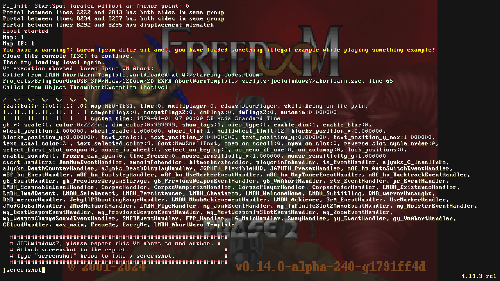

# (ZDOOM) YOUR_NAME_HERE (SFW)

| Detail | Value |
| - | - |
| For | GZDoom & Derivatives |
| Requires | . |
| Conflicts with / Replaces | . |

This is a template to make one time VM-Abort based warning.

## Warn Message

You can have this activated with your own logic, which when true, this mod will trigger a VM-Abort for once. A Cvar flag will raise that marks to not VM-abort anymore.  
The Cvar will reset when quit, so your VM-abort warn message can trigger every startup.

## Return to BringYourOwnUSB-SFW

[Click Here](https://github.com/Perkedel/BringYourOwnUSB-SFW)